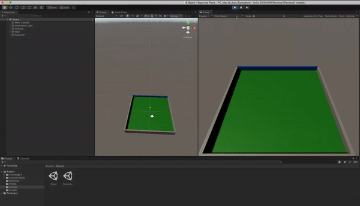

# Random object spawner and destroyer
> A 3D game developed using Unity game engine.

## Game Sample:

## Release History

* 0.1.1
    * CHANGE: Update docs (module code remains unchanged)
* 0.1.0
    * The first proper release
* 0.0.1
    * Work in progress

## Meta

Author: [Prasad Hajare](https://www.itsprasad.com/), MS Computer Science.

Distributed under the [MIT License](LICENSE).

<!-- Markdown link & img dfn's -->
[npm-image]: https://img.shields.io/npm/v/datadog-metrics.svg?style=flat-square
[npm-url]: https://npmjs.org/package/datadog-metrics
[npm-downloads]: https://img.shields.io/npm/dm/datadog-metrics.svg?style=flat-square
[travis-image]: https://img.shields.io/travis/dbader/node-datadog-metrics/master.svg?style=flat-square
[travis-url]: https://travis-ci.org/dbader/node-datadog-metrics
[wiki]: https://github.com/yourname/yourproject/wiki
